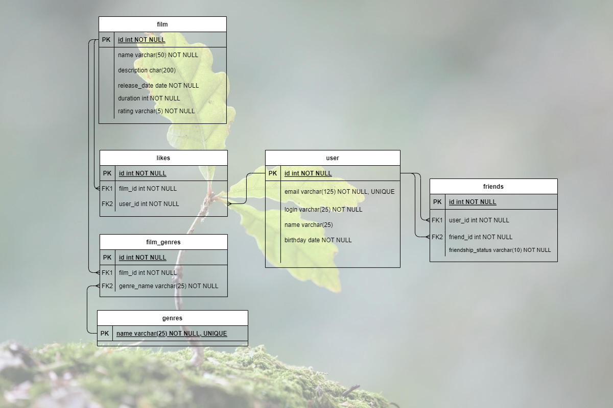

# java-filmorate

Template repository for Filmorate project.

-----
Схема базы данных проекта:


---
ОПИСАНИЕ ПРОЕКТА

Пользователь:

Создание
Редактирование(обновление)
Удаление пользователя
Добавление в друзья другого пользователя
Удаление из друзей
Поиск пользователя по его id
Поиск пользователя по его mail

Фильмы:

Создание
Редактирование(обновление)
Удаление фильма
Поставить лайк фильму
Удалить лайк
Найти определенный фильм


ПРИМЕРЫ ЗАПРОСОВ

Получение списка 5 наиболее активных пользователей

```sql
SELECT u.name
FROM user AS u 
JOIN likes As l ON u.id = l.user_id
GROUP BY u.id
ORDER BY COUNT(l.user_id) DESC
LIMIT 5;
```

Найти топ N самых популярных фильмов

```sql
SELECT f.name AS name,
    COUNT(l.user_id) AS likes
FROM film AS f
JOIN likes AS l ON f.id = l.film_id
GROUP BY f.name
ORDER BY likes DESC
LIMIT N;
```

Вывести топ N опулярных жанров

```sql
SELECT genre.genre, count(l.user_id) as cnt
FROM film_genres as genre
JOIN film AS f on genre.film_id = f.id
JOIN likes l on f.id = l.film_id
GROUP BY genre.genre
ORDER BY cnt DESC
LIMIT N;
```
